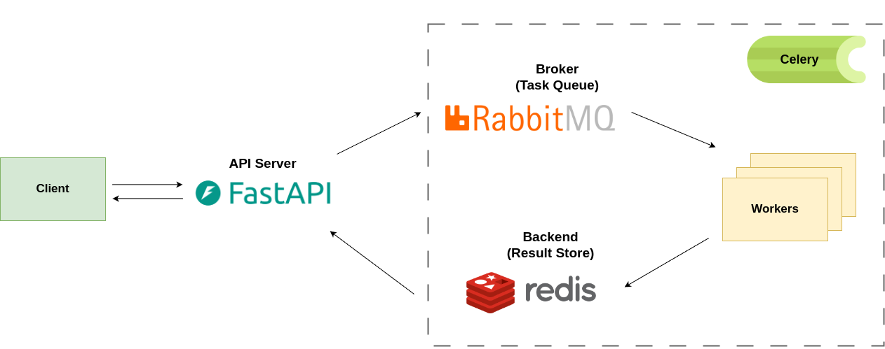

# Daily News Summarizer

The Daily News Summarizer is an automated news aggregation tool that leverages Retrieval-Augmented Generation (RAG) and a message queue architecture to crawl, parse, and deliver daily news summaries. The tool finds the latest news articles, stores and processes them with vector databases, and provides customized daily digests tailored to user preferences.

## 🚀 Features

- **Automated News Crawling**: Continuously retrieves the latest articles from specified sources, storing raw HTML for parsing and further processing.
- **Retrieval-Augmented Generation (RAG)**: Combines retrieval and language generation techniques to improve content summarization accuracy and relevance, especially for user-focused summaries.
- **Content Parsing and Vector Storage**: Extracts main content from raw HTML, converts it into vectors, and stores it in a vector database for efficient retrieval and similarity-based search.
- **User-Customized Summaries**: Delivers daily news digests based on individual user preferences, powered by RAG to ensure relevant and concise summaries.
- **Message Queue Processing**: Uses RabbitMQ, Redis, and Celery Workers to efficiently manage background tasks and message queues, supporting seamless data handling across the application pipeline.

## 🏗️ System Architecture

The architecture of the Daily News Summarizer project is structured to handle asynchronous task processing, with FastAPI serving as the API server, RabbitMQ as the task broker, Redis as the result store, and Celery workers handling background tasks.



## 🛠️ Technologies Used

- **FastAPI**: Backend framework to build and serve API endpoints.
- **RabbitMQ and Redis**: Queue and broker systems for message queue management, essential for handling asynchronous task processing.
- **Celery Workers**: Processes tasks such as crawling, parsing, and database updates, enabling efficient queue-based workflows.
- **Vector Database**: Stores article content as vectors, which supports relevance-based retrieval and fast similarity searches.
- **LangChain and OpenAI**: Integrates LLM and RAG capabilities, leveraging OpenAI models for enhanced summarization and personalized user responses.

## 🔄 Workflow

The application workflow leverages message queue processing and RAG methods to ensure efficient, accurate news delivery:

1. **Homepage Crawl**: Begins by fetching new article links from a news homepage.
2. **Save Metadata and Raw HTML**: Stores metadata and raw HTML content in the database for processing.
3. **Parse HTML Content**: Extracts key article content and metadata from raw HTML.
4. **Vector Storage with RAG Support**: Converts parsed content into vectors and stores them in a vector database, ensuring unique content and efficient relevance-based searches.
5. **Daily Summaries**: Provides users with customized, RAG-enhanced summaries of the latest articles based on individual preferences.

## 📦 Installation

### Requirements

- Python 3.10 or higher
- This project uses Docker to simplify the setup and deployment process. Below are instructions for setting up the project using Docker and Makefile commands.

### Setup Guide

1. **Clone the Project**:
   ```bash
   git clone https://github.com/pmhoang11/DailyNewsSummarizer.git
   cd DailyNewsSummarizer
   ```

2. **Configure Environment Variables**:
   Set up the required API keys and configuration details in a `.env.example` file.

3. **Installation with Docker and Makefile**:
    The `Makefile` includes commands to simplify Docker operations. Below are the main commands:

   - **Build the Docker Image**:
     ```bash
     make build-base
     make build
     ```

   - **Run the Application**:
     This command will start up the application, RabbitMQ, Redis, and the Celery workers.
     ```bash
     make start
     ```

   - **Stop the Application**:
     Stop all running Docker containers related to the project.
     ```bash
     make stop
     ```

4. **Accessing the Application**:
   Once the containers are up, the application will be available at `http://localhost:5000/docs`.


## 🎯 Contributing

Contributions are welcome! To get involved:

1. Fork this repository.
2. Create a new branch with your feature or fix.
3. Make the necessary changes and submit a pull request with details of the modifications.
